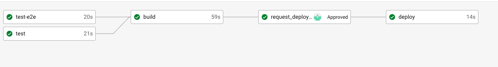
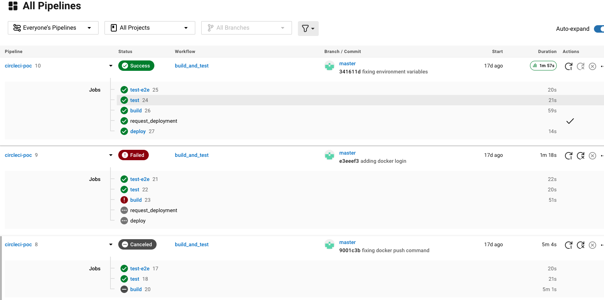
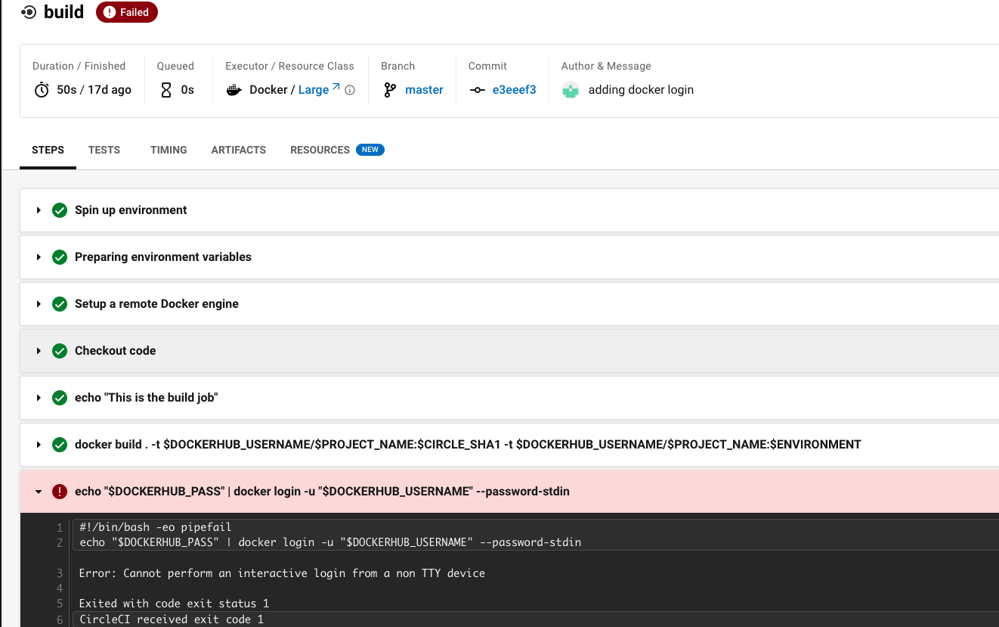

# CircleCi PoC

PoC repo: https://github.com/sergioCB95/circleci-poc

## CircleCi

CircleCI is the world’s largest shared continuous integration and continuous delivery (CI/CD) platform, and the central hub where code moves from idea to delivery.
As one of the most-used DevOps tools that processes more than 1 million builds a day, CircleCI has unique access to data on how engineering teams work, and how their code runs.
Companies like Spotify, Coinbase, Stitch Fix, and BuzzFeed use us to improve engineering team productivity, release better products, and get to market faster. [[GetApp]](https://www.getapp.com/it-management-software/a/circleci/)

## PoC Description

For the PoC, we used a NestJS base template as the project on which to set up the CI/CD pipeline with CircleCi.
This project is basically a Rest API with a "Hello World" endpoint.

The project already includes examples of unit and e2e tests, as well as commands to run them, which will be very useful when generating our pipeline.

The only addition that has been made to the base template is a Dockerfile, which will be used during the pipeline to generate and register a Docker image.

### CI/CD Pipeline

The file [.circleci/config.yml](.circleci/config.yml) contains all the CI/CD project pipeline configuration.
By default, CircleCi will look for the pipeline configuration in this file.

The pipeline represents a basic pipeline of a dockerised application, which will be created and registered in a Docker image registry (in our case Docker Hub) and later retrieved from there and deployed anywhere.
In our case, the image will simply be pulled from Docker Hub (to check that it can be done without any problem) but it will not be deployed anywhere.

To avoid hardcoding sensitive data in the configuration file and to make it more generic, so that it can serve as a basis for other projects, we have introduced a set of environment variables.
These environment variables will be injected into the pipeline from the `contexts` specified at each stage of the pipeline (more info on `contexts` in CircleCi [here](https://circleci.com/docs/contexts)).

The variables to be inserted are:

- DOCKERHUB_USERNAME: name of the Docker Hub account where the generated Docker image will be uploaded
- DOCKERHUB_PASSWORD: Docker Hub account password
- PROJECT_NAME: project name. This is not a sensitive data, but can also be specified from outside the pipeline
- ENVIRONMENT: environment in which the pipeline is running. It is simply used to emulate that there can be more than one environment, which is a fairly common requirement.
- CIRCLE_SHA1: variable automatically generated by CirleCi, contains the unique id that identifies the current pipeline execution.

The phases of the pipeline are the following:

- `test` and `test-e2e` phases: they run in parallel and will run the unit and e2e tests of the application, blocking the pipeline if they do not work.
- `build` phase: dependent on the previous two, it will build a new Docker image, tag it accordingly and upload it to Docker Hub.
- `request_deployment` phase: dependent on `build`. Control phase, which does not perform any action. It blocks the pipeline waiting for manual approval to continue with the execution of the pipeline.
- This type of block is useful if you want to perform a manual check before proceeding with the pipeline or if you prefer to manually approve a critical action (e.g. production deployments).
- `deploy` phase: mock phase where the app should be deployed where needed.

## Conclusions

### Integration with Github (and Bitbucket)

Currently, CircleCi only allows you to create continuous integration pipelines for repositories on Github and Bitbucket.
Although Github already has a native option to create CI/CD pipelines, the option to use CircleCi is still very interesting.

The integration between Github and CircleCi is very simple, by simply linking your CircleCi account with Github, Github will take care of all the necessary actions for your projects to integrate with CircleCi.
It will also take care of creating the necessary hooks in your repositories every time you include a project in CircleCi.

Compared directly to Github Actions (Github's native option), CircleCi is a much more mature option that currently offers a greater number of features than its competitor, with the trade-off that it has to be managed from outside the platform.

### Orbs

[Orbs](https://circleci.com/orbs/) are reusable configuration packages created by the community, CircleCi or you can create your own.
These packages are easily printable in our pipelines and allow us to encapsulate and reuse common functionality.
Thanks to the large community that uses CircleCi, there are already a multitude of orbs created that allow integration with multiple services and tools, such as many services from major cloud service providers, Kubernetes, Slack, etc.

### Virtual Machines

CirleCi allows great flexibility in choosing the virtual machine that will execute the different phases of the pipeline.
It allows any Docker image (https://circleci.com/docs/using-docker) to be used as the VM on which the actions of each phase of the pipeline are executed.
In addition, CircleCi has already implemented a number of basic Docker images that cover a large number of use cases (https://circleci.com/docs/circleci-images).

Apart from being able to use any Linux distribution (thanks to Docker), CircleCi also offers MacOS and Windows VMs, which allows us to run our pipelines on any kind of machine and cover any kind of need.

### GUI

CirleCI's user interface is very clear and simple. It allows to perfectly understand both the pipeline structure and its state, as well as to understand what is going on inside the pipeline.
This is very useful, especially for studying why a pipeline is failing or not working as expected.

### Advance Features

CirleCi implements a number of advanced features which are very useful to complement and manage the pipelines created, some of them are:

- [**SSH Debuging**](https://circleci.com/docs/ssh-access-jobs): CircleCi allows you to connect via SSH to the machine running the pipeline in order to study its status and accurately debug any problems.
  For this, it will leave the machine on until we manually indicate that we have finished debugging or if no SSH connection is received for a period of x amount of time.
- [**Pipeline Insights**](https://circleci.com/docs/insights): CircleCi collects metrics on our pipelines and allows us to visualise them through a series of graphs in which we can study the performance of our pipelines, as well as study their costs, etc.
- **[Tests result](https://circleci.com/docs/collect-test-data) and [coverage](https://circleci.com/docs/code-coverage) storage**: CircleCi also allows you to save the result of your tests in each execution of the pipeline, as well as the test coverage of your application, similar to some static code analysis tools.
- [**Artifact Repository**](https://circleci.com/docs/artifacts): CircleCi allows you to save the artifacts created in each pipeline, being able to generate a repository of artifacts, in which you can have access to older versions of your application.

### CirleCi API

CircleCi provides a vert complete [API](https://circleci.com/docs/artifacts)  that allows you to integrate your applications with it. This allows other applications to interact with CircleCi, receive notifications or events that occur in the pipelines and even launch pipelines manually from other applications.

## Pros / Cons

- Pros :white_check_mark:
    - More mature option than Github Actions
    - Easy integration with Github
    - clear GUI
    - Large community and multitude of Orbs that simplifies pipeline creation
    - SSH Debugging is :fire: for debugging pipelines
    - complete API
- Cons :x:
    - It is not directly integrated with code repository (Github).
    - It has small downtimes relatively frequently (from my own experience).
