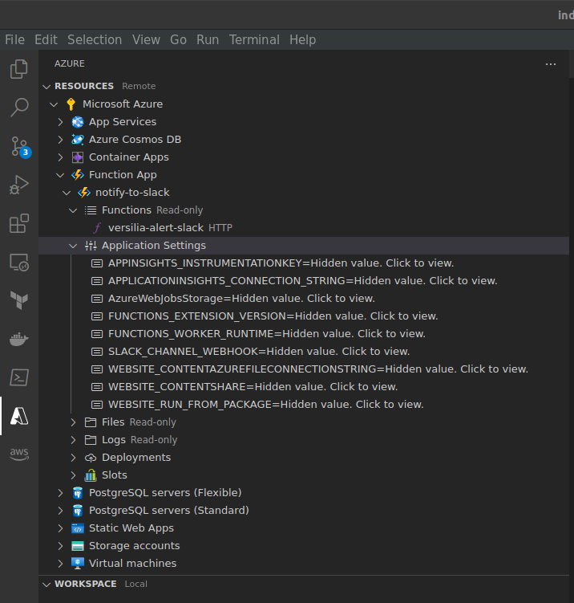

# Introduction 
Here there is some sample code to setup alerting from azure application insights into slack with an azure function and the modules to be used in Terraform. This scenario will consider the code implication in the `Versilia` project

- Azure function
    `JS` script to be sent by Slack.
- Terraform modules
    The terraform modules used for the dashboards and alert rules deployment in the different environments

# Installation
This is the URI for the repository https://dev.azure.com/onebeyondinternal/Chapter.Spain.DevOps/_git/MonitoringAzureApplicationInsightsToSlack
We will simply clone the project locally and made the necessary modifications. In the future this will be more standarized implying less modifications over the original code and simply changing the necessary `variables` before we use it in a different project. 
# 1. Azure function
The function stored in the repository is based on the body received from the common alert schema. Might not adjust for the alerts rules you want to consider.
https://learn.microsoft.com/en-us/azure/azure-monitor/alerts/alerts-common-schema-definitions
To upload any changes in the Azure function, the resource was created through the **Azure** plugin for `Visual Code`. This will save some time when uploading your `zip` file and keep have a global view of the resource created

# 2.Terraform modules
In the repository you can find the samples used for the project Versilia or a sample of a dashboard building. Also, in the module `alerts` the rules created for this project too. 

## 2.1 Dashboards
For the creation of dashboards, we will highly recommend to create a dashboard from Azure portal and then modified with the necessary variables, custom values, etc... after exporting the `JSON` for the dashboard
`Shared Dashboard > Export > Download` this will download a `JSON` file with all the values created in your dahsboard. Follow also the documentation in https://registry.terraform.io/providers/hashicorp/azurerm/latest/docs/resources/dashboard
You won't need some parts of the `JSON` downloaded. There is a small deconstruction of the resource's creation

# 2.2 Alerts
Refs: https://registry.terraform.io/providers/hashicorp/azurerm/latest/docs/resources/monitor_metric_alert